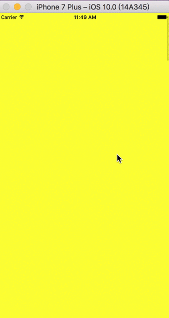
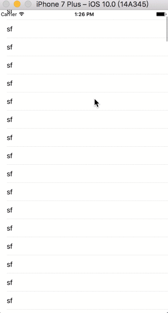

# BackMenu
## 带有滚动视图的前后切换

主要实现当主要界面是滚动视图，想在滚动视图到顶时继续滑动出现隐藏的内容视图

## Demo1实现思路

 * 思路：

 1. 两个scrollView嵌套
 2. 当前面的scrollView滑到顶部，无法再滑动，不会监听滑动，而是传递到后面的ScrollView上
 3. 将后面显示的内容放到后面scrollView的contentInset区域
 4. 当后面scrollView监听到didScroll事件时，根据偏移量判断：如果后面的内容出现了，禁用前面scrollView的scrollEnabeld，保证后面显示内容出现时，再滑动前面scrollView时还是运行后面scrollView的事件，能滑动回去，而不是滑动前面scrollView的内容；当后面的内容完全被前面的scrollView覆盖时，启用前面的scrollView的可滑动

 * 效果

## Demo2实现思路
 
### 主要技术点：
1. **手势冲突问题**
 * **问题描述**：

 * 所有的scrollView都滑动时都有一个panGesture手势，负责滚动，如果手动添加另外的手势，会有手势冲突问题，所以需要通过UIGestureRecognizerDelegate中的方法解决手势冲突问题

 * **解决方法**：

 * 先用requireGestureRecognizerToFail:方法设置手势依赖，将自定义的手势优先级作为最高，然后设定一个全局标识，通过标识在gestureRecognizerShouldBegin:中判断是否开始手势，如果return NO，会向自定义手势发送一个UIGestureRecognizerStateFailed:信号，此时会执行scrollView自带的手势
 
2. **临界点切换问题**
 * **问题描述**：
 
 * 手势冲突解决方法中，已经通过全局标识可以控制手势的执行先后问题，但是何时改变标识？

 * **解决方法**：

 * 当scrollView滑动到顶部时改变标识，滑动到顶部有两中情况：一是手动滑动到顶部，二是减速滑动到顶部，所以分别通过scrollViewDidScroll:,scrollViewDidEndDecelerating:监听是否到达顶部，一旦到达切换标识状态
 
 
3. **scrollView整体滑动问题**

 * **问题描述**：

 * scrollView整体会根据手势滑动，如果直接根据手势位置动态改动scrollView的位置，界面渲染量太多，会影响性能

 
 * **解决方法**：

 
 * 手势开始滑动时，先将滑动的视图截图，然后隐藏原视图，滑动时平移截图，知道滑动终止时，删除截图，同时将原视图放置在终止的位置并显示
 
4. **位置动态调整**
 * **问题描述**：

 
 * 自定义手势滑动出现背后的视图时，可能滑动动作没有让后面视图完全展示，此时需要根据滑动的终点位置判断用户行为，是需要完全展示呢，还是需要隐藏呢？

 
 * **解决方法**：

 
 * 先设定一个邻域范围，手势滑动停止后，结合滑动方向以及滑动结束后的位置动画调整到最终位置
 
5. **手势方向判断**

 * **问题描述**：

 
 * 拖动手势没有位置属性，需要自己手动判断

 
 * **解决方法**：
 * 设定一个静态变量，记录上一次位置的值，当手势开始或者改变时通过当前位置和上次位置的相对位置判断方向
 
* 效果

  

